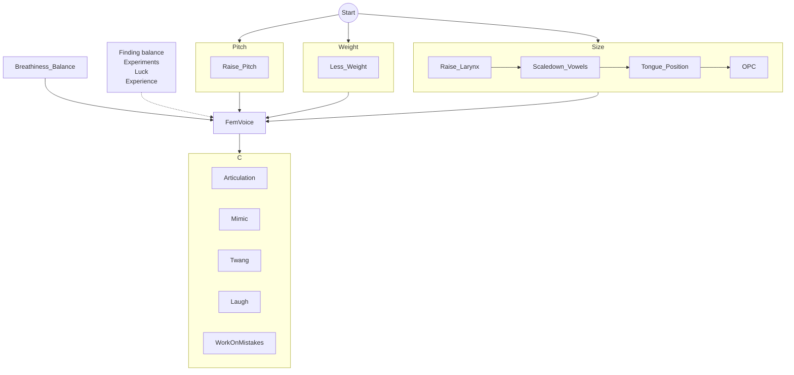

# TODO section
- Main goals for all components and high level steps
- Pitch training https://singingcarrots.com/pitch-training#game 
- Pitch plan: exlore, extend high boundary, 
- pitch matching: define range of notes, unison (TVL good example of what you should hear), leave playing sample sound, 
- pitch matching: play sample for short amount of time - try to match up (pitch tracker can help to check yourself or you will hear unison)
- pitch matching: try instad of toen geneartor other instruments: piano (online piano: https://www.onlinepianist.com/virtual-piano ;  apple garage band grand piano)
- pitch matching: match along to a song or a person talking try to follow the pattern of speech (check vocal range may be before)
- pitch matching: pitch matching with resonance and vocal weight
- define parallel tracks. requerments for every drill: previous drill completion
- pitch matching: final goal: match speech pattern/articulation/intonation
- quite/non-breathy: low air + lowputch -> high pitch. v/f -> humming. high resonance uncover breathiness. if fail: try to deep resonance + low air + high pitch a3/g3 -> rise resonance.

# Intro
This self-teaching guide helps AMABs have female voice after puberty period. Only exercises. Guide based on SMART criteria (Almost all chapters). 

## Our goals
We gather all best in one place. Trying to give one step-by-step guide with voice examples 
with definiton of done for every step.

## Key guide components
For every aspect:
- theory
- ear training
- exercises

Main chapters:
- Exercise plan
- Voice components
- Exercise list
- Communities
- Teachers

[I don't wanna read intro, let's start](#Plan)

# What is SMART
[SMART criteria - Wikipedia](https://en.wikipedia.org/wiki/SMART_criteria)

## Specific
What is result? Why it's important? (+W) What/where. Resources and limitations

## Relevant
Why do you need it?
Checklist is it good time for it: resources, time/__requirements__. Requirements can include some previous exercies.

## Achievable
How to achieve. Other's experience. Do you have enough of resources? (define amount of resources. time/experience/etc)

## Measurable
How to get you done it? Defenition of done.

## Time-bound
No deadlines. Let's try put here time for one exercise or complexity in stars. Do until you pass M.

## -Donos
What you should avoid.

## +Why
Why we are setting this goal (R?)

## +Links
Links/references to examples/guides

# Overview
## These exercise are against
- difference in vocal tract size changes during male puberty period
- articulation differences
- behavior of making loud sounds
- pitch difference

TODO links
TODO make quick overview (https://christie-block-lzjg.squarespace.com/transfeminine-speakers)

## So our goal (SMART)
S: As a males by birth we are going to learn female voice. It can be done in isolation of people but internet needed to hear examples/materials and with help of [online tutors](#Teachers). We need time (lot of time), may be place for voiced exercises (throat/mouth/tongue/etc). Time for thinking about exercises. Exercies don't change you default voice. But you can forget how to speak in it if you don't use voice. Exercies have good impact for [singing] (https://www.youtube.com/watch?v=t8EcTotO6no) and voice acting. (There are common skills).

M: 
1) People: goal is completed when we passing as female by voice.
2) Your own goal for your voice: pitch, articulation, accent, resonance. Your parameters are near to your reference.

A: Many people have done voice transformation w/o surgery. Here are examples: TODO Demos: L's., adi, YT trolls. EXCEPTIONS?
To pass you should do exercises. Here is a [plan](#Plan).
Where you can find people who are in process or finished: discord/reddit (TODO). Allocate time or do in random period of time and have [place](#Place for training) for your experiments. What can make goal unachievable? TODO

R: You can do exercise time to time. Think about motivation and are you really need it? 

T: It can take too much time. 1 year? Or one month for decent result. 
It depends on you: your vocal background, your vocal tract shape, your ability to control muscles and your time.
Nobody knows how much time you need. You can work on your voice every day twice for 15 mins or twice per week 30 mins. 
You can be [vocal underdoer](#Vocal underdoer) < singer/vocal actor.
You can have already small enough vocal tract. So you need less effort for voice feminization.
If you are busy, 15 mins/day is really good enough for exercises.

TODO compare to other skills by complexity/time
Car driving?

-D: we are avoid strain/pain/etc TODO SOVTEs health link

+W: I don't know why do you have this goal:
- you are trans MtF and this skill is critical for you
- you are FtM on HRT and you need learn female voice
- you are going to be voice actor
- you want be a voice troll
- you want answer on help desk calls with fem voice 😃 (who knows)

## scary mind maps
### learning path

### mind maps/etc
https://www.mindmeister.com/map/2498331508?t=TtfllkiIdI

TODO: discord mindmap is more detailed

# Plan
## How to teach yourself
Key aspects:
- regular basis/time
- comfortable place for exercises
- don't hurt yourself/health
- theory -> ear training -> exercises -> applying to voice
- record your progress

Have time and plan what you will do.

Have [place](#Place for training) for voiced exercises.

Do SOVTEs - when it needed WHEN? TODO

Ear training.

You are good in mimicking by nature.

If smth is not going well - leave it - read/search info/think about it and return back

About developing skills from TVL Christmas stream (keyword: pedaling)

Record you progress (select phrase for it). Progress should be measurable. When you hear your progress it motivates you.

## Finding Inspiration
S: find fem voice you like.

R: Optional, we'll go back to this 2nd time. It can be not easy process. We need start learning process to have understanding voice features/differences.

M: several references is good enough (like name or link in the internet).

A: there are collections of examples TODO. How to find examples TODO. Analyze voices think about what features you like in theses voices.

T: don't spend too much time on it. You can do it in a background.

+W: later we'll copy that voices or some behavior/articulation and build ours voice

+L: [Voice examples](#Voice examples)

## Onsets
TODO SMART

R: just watch and try.

T: Don't focus too much. Once is enough.

+L: https://www.youtube.com/watch?v=Y9pKZt7R1Dk

## Exploring pitch
S: 
1) Answer questions: What is pitch? What is average female range?
2) Our goal is to explore your vocal range
3) and speak in higher pitch

+W: Average female voice has higher pitch than masculine voice.

-D: Pitch is less significant than other components like weight and resonance. There is no strict requirement for extending your higher vocal range limitation.

A: 
1) Read about [Pitch](#Pitch)
2) Download [Pitch tracker](#Pitch tracker)
3) Do slides LINK
4) Optional. Explore you vocal range LINK
5) TVL: pitch
6) Speak higher than F3, try don't cross F3 boundary

M: You can fluently speak higher than F3 don't crossing F3. 

It will be weird - it's ok. Your voice can be cartoonishnot and hollow.

But you may would like lower voice. So you can define lower boundary than F3.

## Exploring pitch and weight
S: [Vocal folds weight](#Weight). We'll develop control skill over weight.

### Loudness/air speed/weight
### Pitch isolated
### smooth slides
Go up and down

listen TVL video

### sounds, mmm, vowels, words, sentences

## Exploring size: larynx height
A: 
Exporing:
1) Touch Adam's apple and swallow. Larynx went up.
2) Try yawn. Larynx went down.

exercises
1) big dog/small dog
2) siren whispers

M:
 1) ear training:
	 1) external noise,
	 2) hissing/whisper, 
	 3) apps

-D: don't push your larynx with our fingers/etc. Don't apply to much strength.

## Vowels in small size

Scaling (down/up ?) vowels

Starting position
1) larynx up
2) 'kee' (L's 2.4) or 'heel' sounds are good triggers to push larynx up. 
3) speak vowel/simple word with this vowel - and control vowel/word shouldn't be distorted
4) touch & feel Adam's apple - won't go down
5) reset to 1

When you feel all sounds are good. Try to speak sentances.

You may notice that some sounds cause the larynx to go lower. Work on fixing them.

## Adding pitch to resonance
## Combining pitch/size/weight
## FVF
## OPC
[Stich voice breakdown by NY Vocal Coaching](https://www.youtube.com/watch?v=SuVe9dToYuQ)

## Improvements
Improvements and common mistakes

### Bad lips habbits

[Quick Voice Tips: Avoid Bad Lip Habits! by TVL](https://www.youtube.com/watch?v=gviIEbgvIbk)

-----------------------------------------

# Voice components
## Weight
aka vocal fold weight
aka EGG, contact quotient, open/closed quotient in science literature
aka vocal fold mass
aka thickness/thinnes of vocal folds

Weight is important fundamental of voice feminization. Developing weight control is important to build female voice.

Male voice have more weight than female. (Male vocal folds are thucker than female (because of testosterone))

More weight - more audible buzziness.
Less weight - more breathy.

+L: LINK: adi/TVL/savvvy/Selene
(Olivia Flanigan) https://www.youtube.com/watch?v=vwv0JlCIXHE

## Vocal twang
L's (3.8 https://www.reddit.com/r/transvoice/comments/d3cq5l/ls_voice_training_guide_level_3_for_mtf/ )
https://www.youtube.com/watch?v=1BLVrYKmwvc L's 
https://www.youtube.com/watch?v=xAvCrxaLRvI (twl) L's
https://www.youtube.com/watch?v=tD0MT50Ufos
https://www.youtube.com/watch?v=-e5ULS6EURU

## Pitch
Men: 85-180 Hz (average)

Woman: 165-255 Hz (average)

Country/language-specific: [Language pitch by Erik Bernhardsson](https://erikbern.com/2017/02/01/language-pitch.html)

And we are talking about notes: F3, A3, A2, etc LINK

lower boundary can be covered by [Vocal fry](#Vocal fry)

+L: TODO links to wikis about pitch

## Vocal fry
Creaky sound at lower boundary of vocal range.

TODO TVL?

Example: 

https://youtu.be/UsE5mysfZsY?t=18

## Resonance
Aka size of vocal tract/timbre/brightness.

IRL example: sound when you fill bottle of water.

1) OP + Larynx (R1 or F1 [formant](#Formant) )

2) Mouth space (R2 or F2)

### Larynx
### OPC
aka oropharyngeal constriction, pharynx constriction

[ear training by Savvy](https://soundcloud.com/savvy-sav-446247814/opc-ear-training/s-DkeFkTQe88T)

**The Mallampati score** is one assessment to describe the relative size of the base of the tongue compared to the oropharyngeal opening in hopes of predicting the difficult airway
Stitch

### Mouth space
### Smiling 
Smile makes sounds bright but people hear you are smiling. It won't be applied to all situations.

## Soft palate
nasality

## Formant
TODO

F0 - pitch,
F1 - larynx/pharynx (aka R1)
F2 - oral space (aka R2)

## FVF
aka false vocal folds, vestibular fold, ventricular fold
False vocal folds (false cords) close air passage when you swallow/eat.
FVF are used in singing to produce vocal effects such as growls, rasps or screams ([metal singer distortion](https://youtu.be/o6QoeBmq9zY?t=498)).

[TVL doc](https://docs.google.com/document/d/1sH8EyvMcGkt_4pOBY4EzfW2MLFfrfL3LnZNsfV-0n3c)
[TVL video](https://www.youtube.com/watch?v=xdsaPJdU24s)

## Vocal range
https://www.youtube.com/watch?v=9IejHKpfHso

## Loudness

## Breathiness
Your sound is too breathy. What caouses breathiness:
1. Vocal folds are too open. Try to start from creak (constricted)
2. You pushing too much air through vocal folds
3. Before making voiced sounds your vocal folds are too open.

Breathiness in singing: [1](https://www.youtube.com/watch?v=J4vgDegu9ww) [2](https://www.youtube.com/watch?v=ojHV7u9eLSg)

-----------

# Voice exercises
## Weight/pitch
### Slides
### Speak in high pitch
### Pitch matching

[online tone generator](https://szynalski.com/tone#C3,v0.75)
[online piano](https://www.onlinepianist.com/virtual-piano)

## Resonance
### Siren Whisper
### Vampire Whisper
### Big dog/small dog
### Scale eng vowels
OPC vowels/words:
- heed
- hid
- head
- had
- hod
- hawed
- hood
- who'd

### Bright S-sound
Mimic: [Clyp by Adi] https://clyp.it/t3lhcmwf

tip: try a little bit smile: so corners of the lips

BTW: avoid [bad lip habbits](#Bad lips habbits)

## Cough
[by TVL](https://www.youtube.com/watch?v=IP-mRByleSc)

## Laugh
It is a good time to rebuild laugh habbit and select laugh you like.
- [wikihow](https://www.wikihow.com/Change-Your-Laugh)
- [by speechvoicelab](https://www.speechvoicelab.com/blog/2018/5/30/laughing-in-a-more-feminine-or-masculine-way)
- [by Zoey](https://www.youtube.com/watch?v=l1xCKTQOH5k)

## Throat clear

## Sneeze

## Nasality

# Analysis
## Apps
### Recorders
Echo (push to record) [android](https://play.google.com/store/apps/details?id=uk.co.projectneon.echo)

Voice Back: [iOS](https://apps.apple.com/us/app/voice-back-sing-speak/id1071730240)

### Pitch tracker
#### Vocal Pitch Monitor 
[android](https://play.google.com/store/apps/details?id=com.tadaoyamaoka.vocalpitchmonitor) 

can record and shows pitch

TODO see L's guide how to set F3 as highlighted line

#### Nail the Pitch - Vocal Monitor
[android](https://play.google.com/store/apps/details?id=com.autumnrockdev.nailthepitch) [iOS]([Nail the Pitch - Vocal Monitor on the App Store (apple.com)](https://apps.apple.com/us/app/nail-the-pitch-vocal-monitor/id1486640549))

#### Online
see L's guide

### Tone generator
#### online 

### Formant/spectrum tracker
#### InFormant
https://in-formant.app/

#### Friture
Mel scale

#### SonicVisualiser
[download]([Nail the Pitch - Vocal Monitor on the App Store (apple.com)](https://apps.apple.com/us/app/nail-the-pitch-vocal-monitor/id1486640549))

#### Spectrus
[in-browser](https://spec.sumianvoice.com)

## Noise
TVL downloads

online brown noise/noise generators

## Ears
### Your ears
By default you can't hear yourself as it do people near to you. WHY TODO

#### palmuting - hear yourself (hands)
But you can do it with your hands.

[by TVL](https://www.youtube.com/watch?v=hniY6-QOWKg)
[by Singgeek](https://www.youtube.com/watch?v=-e5ULS6EURU&t=298s)

#### 
or have headset with transparent hearing or https://www.reddit.com/r/transvoice/comments/10rsshp/voice_training_in_real_time_with_walker/

#### Ear training
#### recording

Do records with same sounds/sentences to measure your progress or hear yourself

### External ears
reddit/discord/tutor

### What to say
You can stuck what to say when do trills

You can count, say months, days.

There are set of long phrases (reddit) and short (TVL)

Short are good for your recordings. Later you can compare your progress.

# Voice health

# Misc
## Place for training
Quick ideas:
- Car
- Say you are interested in voice-acting/singing
- Voiceless: everywhere
- Music can hide you sounds
- Small and not reverberating spaces
- Nobody is at home
+L: [CTRL-F [PP] ](https://www.reddit.com/r/transvoice/comments/mgaci7/solid_introductory_voice_training_resources/)

## Vocal underdoer
## Pitch low boundary creek

# Teachers
Lessons: Group vs individual, private and public.

## How to select teacher
Price/quality/comfortable

Find examples of lessons

Time/timezone

Language

## Where are they?

### TransVoiceLessons: Zheanna, Clover, Vivienne
- [web](https://www.transvoicelessons.com/)
- [YT](https://www.youtube.com/c/transvoicelessons)
- [Petreon](https://www.patreon.com/transvoicelessons/)
- Discord is paywalled. Events.

### Trans Voice Coach: Adi
- [web](https://www.transvoice.coach/)
- [Discord](https://discord.gg/S7pgQgean9) archive of prev lessons/workshops recordings

### Vox Nova: Selene
- [web](https://voxnovastudio.com/)
- [Discord](https://discord.gg/WfKk3EMRk5) workshops/events. Really good introductinal events.
- Singing

### Scientifically Augmented Voice: Savvy
- [Discord](https://discord.gg/dbwrQMV) - recordings of public lessons and events
- beatboxing 

### Scinguistics
- [web](https://cramdvoicelessons.blog/)
- [Discord](https://discord.gg/vFkYUdTPS4) - public events

### Sumian Voice: Sumi
- [web](https://sumianvoice.com/)
- [Discord](https://discord.gg/ahc5hb9zSk) - public lessons recordings
- [wiki](https://wiki.sumianvoice.com/)

### Fluid Voice Studio: Dusty
- [web](https://www.fluidvoice.studio/)
- [Discord](https://discord.com/invite/6J99rRAvvp)

### Seattle Voice Lab
- [web](https://www.seattlevoicelab.com/)
- [Discord](https://www.seattlevoicelab.com/discord/)

### Undead Voice Lab: Nicole Gress
- [web](https://www.undeadvoice.com/about)
- [YT](https://www.youtube.com/@undeadvoicelab)
- [IG](https://www.instagram.com/undead.voice/)

# Communities
# Voice examples
## Banks
 - [By Adi: fem voices exploration - YouTube](https://www.youtube.com/playlist?list=PL054AsyPIr1a027-oUYLJwW6DN54-jvv5)
 - [By Sumi: Voice Examples](https://wiki.sumianvoice.com/wiki/pages/voice-examples/)

## YouTube e-girl trolls

# Guides
[Adi's old](https://docs.google.com/document/d/1MOd5CJQUGmUD5e1p7_CLxWLU-aFiUTmKvL0SoT-LhEk)

[Sumi's wiki](https://wiki.sumianvoice.com/)

[TVL YT: not ordered](https://www.youtube.com/@TransVoiceLessons)

[TVL Glossary](https://docs.google.com/document/d/1FPDd2YIkYFVjghNFifAy-PUl0IuyKeB4I8xKJWIXdjc)

[Outdated L's](https://www.reddit.com/r/transvoice/comments/d3clhe/ls_voice_training_guide_level_1_for_mtf/)

# Thanks
TVL/Zheanna 
Adi
Savvy
Sumi
Zoey
