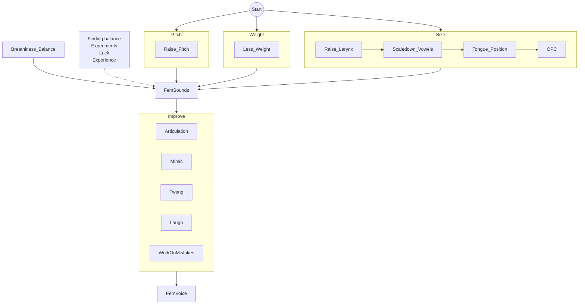

# Intro
This self-teaching guide is designed to help individuals who were assigned male at birth (AMAB) develop a female-sounding voice after the puberty period using exercises. It is not harmful and is based on the SMART criteria (with almost all chapters meeting this standard). The guide is a work in progress.

## Our goals
We (the authors) have gathered all the best in one place. Trying to provide a step-by-step guide with voice examples, including a definition of "done" for every step.

## Key guide components
For every aspect:
- theory
- ear training
- exercises

Main chapters:
- Exercise plan
- Voice components
- Exercise list
- Communities
- Teachers

[I don't wanna read intro, let's start](#Plan)

# What is SMART
[SMART criteria - Wikipedia](https://en.wikipedia.org/wiki/SMART_criteria)

## Specific
(S) What is result? Specific and detailed. What/where.

## Relevant
(+W) Why do you need it? Why we are setting this goal ?

(R) Checklist is it good time for it. Do you have enough of resources? (define amount of resources. time/experience/requirements/etc). Requirements can include some previous exercises.

## Achievable
(A) How to achieve.

(..) Other's experience. 

(-F) Fail case. Half-done.

## Measurable
(M) How to get you done it? Defenition of done. How to measure progress.

## Time-bound
(T) No deadlines defined here. We left practice schedule to yourself. So you can define your timeline.

We put here time for one exercise or complexity in stars (N stars out of 5). Do until you pass defenition of done.

## +Evaluate and re-adjust
(+E) Faced with a continuous problem? It’s time to take a step back and re-adjust sub-goal/practice method.

## -Warns / -Donos
(-W)(-D) What you should avoid.

## +Links
(+L) Links/references to examples/guides

# Overview
## These exercises are designed to counteract the effects of
- changes in vocal tract size during male puberty
- differences in intonation and articulation between males and females
- habits of speaking loudly
- differences in pitch

### Pitch overview
Although pitch is not the sole characteristic used to achieve a more feminine voice, it is frequently the most important one. Without a higher pitch, it can be challenging for most people to sound feminine. On average, cisgender males speak with a pitch that is about an octave lower than cisgender females.

### Resonance overview
Resonance plays a crucial role in determining whether a person is perceived as sounding naturally feminine or like a man with a high-pitched voice. Resonance refers to the way sound reverbs in a space, so for us it is chest, neck and head. Depending on that space your voice can sound bigger, darker, or more boomy, similar to the difference in tone between a cello and a violin. Space can be changed by shifting the placement of your tongue or larynx in the upper airway, you can aim to utilize less of your vocal space, resulting in a smaller, brighter, or less boomy-sounding voice, similar to a violin. This involves directing your vocal sound 'forward'. Learning to manipulate resonance can be challenging, but once you master it, it can make a significant difference in how your voice is perceived

### Intonation overview
In addition to increasing your average pitch, expanding the pitch range of your voice can also contribute to a more feminine perception. One way to achieve this is by being more expressive and moving your pitch around more, especially with higher highs. These pitch movements include:
 - moving your pitch smoothly
 - blending or connecting each sound with the next one
 - sliding into higher pitches to avoid voice breaks and hard voice onsets
 - ending on a slightly higher pitch at the ends of sentences when appropriate for the intended meaning.

### Articulation overview
TODO review

There are some differences in articulation between men and women, although it is important to note that there is also a lot of variability within each gender.

One of the main differences is that women tend to have a more forward tongue placement during speech, which means their tongue is positioned closer to the front of their mouth. There are other aspects to pronouncing more feminine vowels and syllables.

### Overview of other aspects
The typical characteristics of cis female voices include being softer, breathier, and having different loudness control than cis male voices.

## So our goal (SMART)
S: As someone who was assigned male at birth (AMAB), I'm trying to learn how to speak with a more feminine voice. So my goal is to speak with a feminine voice like cisgender women do in their everyday lives, without experiencing difficulties.

This can be done alone, but it's helpful to have access to examples and materials online, as well as the guidance of [online tutors](#Teachers). It takes a lot of time and practice, and it's important to have a dedicated space for vocal exercises. Time for thinking about exercises. Regular practice is essential, as the exercises won't permanently change your default voice, but they can help you improve your speaking and singing abilities. In fact, voice exercises can be beneficial for [singing (YT)](https://www.youtube.com/watch?v=t8EcTotO6no) and voice acting, as they build valuable skills.

-------------------------------------------------------------------------------------------------------------------------------------------------------------

WIP WIP WIP WIP WIP WIP WIP WIP WIP WIP WIP WIP WIP WIP WIP WIP WIP WIP WIP WIP WIP WIP WIP WIP WIP  WIP  WIP  WIP  WIP  WIP  WIP

WORK IN PROGRESS

WIP WIP WIP WIP WIP WIP WIP WIP WIP WIP WIP WIP WIP WIP WIP WIP WIP WIP WIP WIP WIP WIP WIP WIP WIP  WIP  WIP  WIP  WIP  WIP  WIP

-------------------------------------------------------------------------------------------------------------------------------------------------------------
... add lot of people reopening singing for themselves

M: 
1) People: goal is completed when we passing as female by voice.
2) Your own goal for your voice: pitch, articulation, accent, resonance. Your parameters are near to your reference.

A: Many people have done voice transformation w/o surgery. Here are examples: TODO Demos: L's., adi, YT trolls. TODO EXCEPTIONS?

To pass you should do exercises. Here is a [plan](#Plan).

Where you can find people who are in process or finished: discord/reddit (TODO). Allocate time or do in random period of time and have [place](#Place for training) for your experiments. What can make goal unachievable? TODO

R: You can do exercise time to time. Think about motivation and are you really need it? 

T: It can take too much time. 1 year? Or one month for decent result. 

It depends on you: your vocal background, your vocal tract shape, your ability to control muscles and your time.

Nobody knows how much time you need. You can work on your voice every day twice for 15 mins or twice per week 30 mins. 

You can be [vocal underdoer](#Vocal underdoer) < singer/vocal actor.

You can have already small enough vocal tract. So you need less effort for voice feminization.

If you are busy, 15 mins/day is really good enough for exercises.

TODO compare to other skills by complexity/time

Car driving?

-W: 
We are avoid strain/pain/etc TODO SOVTEs health link

Fun fact: Did you know that if you don't use your masculine voice regularly, you can actually forget how to speak with it?

+W: I don't know why do you have this goal:
- you are trans MtF and this skill is critical for you
- you are FtM on HRT and you need learn female voice
- you need it for voice acting
- you want be a voice troll
- you want answer on help desk calls with fem voice 😃 (who knows)

## scary mind maps
### learning path

### mind map
https://www.mindmeister.com/map/2498331508?t=TtfllkiIdI

## What parameters we are going to control
- Vocal pitch
- Vocal weight
- (True) Vocals Cords Closure
- False Vocal Folds closure
- Airflow speed
- Larynx height
- OPC
- Tongue position
- Lips position
- Soft palate

Firstly we are going to control them. Then let brain change them indirectly by hearing sound and build habbits.

# Plan

TODO mermaid flowchart with all chapters.
TODO define parallel tracks. requerments for every drill: previous drill completion

## Quick plan overview
TODO Main goals for all components and high level steps

## How to teach yourself
Key aspects:
- regular basis/time
- comfortable place for exercises
- don't hurt yourself/health
- theory -> ear training -> exercises -> applying to voice
- muscles exercies (not about stength) = finding muscles, moving them, learn how to control them, sometimes isolating muscles control, creating habbits
- record your progress

Have time and plan what you will do.

Have [place](#Place for training) for voiced exercises.

Do SOVTEs - when it needed WHEN? TODO

Ear training.

You are good in mimicking by nature.

If smth is not going well - leave it - read/search info/think about it and return back

About developing skills from TVL Christmas stream (keyword: pedaling)

Record you progress (select phrase for it). Progress should be measurable. When you hear your progress it motivates you.

## Voice communities
join discord servers and be up to date LINK to chapter
find friends with same goals

## Build motivation
Typical it's long story. Not all people can run so long.

Z's video - about embedding exercises in dayling roitine
Renee - ?

Notification based: YT, discord
Competition/support based: friends who are on the same level

## Finding Inspiration
S: find fem voice you like.

R: Optional, we'll go back to this 2nd time. It can be not easy process. We need start learning process to have understanding voice features/differences.

M: several references is good enough (like name or link in the internet).

A: there are collections of examples TODO. How to find examples TODO. Analyze voices think about what features you like in theses voices.

T: don't spend too much time on it. You can do it in a background.

+W: later we'll copy that voices or some behavior/articulation and build ours voice

+L: [Voice examples](#Voice examples)

## Warmup
SOVTEs/etc

[SOVTEs by Adi](https://soundcloud.com/adi-phoenix-658511988/sovte-and-vfe-descrption)
TODO Z's good video

/airflow consist/
https://www.youtube.com/watch?v=PQUo7eimhWA

## Onsets
TODO SMART

R: just watch and try.

T: Don't focus too much. Once is enough.

+L: https://www.youtube.com/watch?v=Y9pKZt7R1Dk

TODO move this to another place Z's video is enough
Types of vocal onsets (from singing):
1. Glottal onset. A glottal onset occurs when the vocal folds come together abruptly, creating a hard or sharp attack. This can create a harsh or abrupt sound, and is common in certain styles of singing, such as punk or hard rock.
2. Smooth onset. A smooth onset occurs when the vocal folds come together gradually, creating a gentle or soft attack. This can create a more fluid or natural sound, and is common in many styles of singing.
3. Breath onset. A breath onset occurs when the singer takes a breath before beginning to sing. This can create a distinct pause or break between phrases or notes.
4. Aspirate onset. An aspirate onset occurs when the singer exhales air before beginning to sing, creating a breathy or airy sound. This can be used for stylistic effect, such as in certain genres of pop or R&B.
5. Glottal fry onset. A glottal fry onset occurs when the vocal folds vibrate slowly, creating a creaky or gravelly sound. This is often used for stylistic effect, such as in certain genres of indie or alternative music.

## Exploring pitch
S: 
1) Answer questions: What is pitch? What is average female range?
2) Our goal is to explore your vocal range
3) and speak in higher pitch

+W: Average female voice has higher pitch than masculine voice.

-D: Pitch is less significant than other components like weight and resonance. There is no strict requirement for extending your higher vocal range limitation.

A: 
1) Read about [Pitch](#Pitch)
2) Download [Pitch tracker](#Pitch tracker)
3) Do slides LINK
4) Optional. Explore your vocal range LINK
5) TVL: pitch
6) Speak higher than F3, try don't cross F3 boundary

M: You can fluently speak higher than F3 don't crossing F3. 

It will be weird - it's ok. Your voice can be cartoonishnot and hollow.

But you may would like lower voice. So you can define lower boundary than F3.

Notice: when we go higher sound can be more breathy. Let's leave that breathy/noisy sound we'll work on it later.

## Vocal underdoers
Z's video
Brief description and definition

## Pitch matching: notes
S: final goal: copy voice intonation you like to develop fem voice behaviour. We need to be good at ptich matching to copy it.
TBD
- Pitch training https://singingcarrots.com/pitch-training#game 
- pitch matching: define range of notes, unison (TVL good example of what you should hear), leave playing sample sound, 
- pitch matching: play sample for short amount of time - try to match up (pitch tracker can help to check yourself or you will hear unison)
- pitch matching: try instad of tone geneartor other instruments: piano (online piano: https://www.onlinepianist.com/virtual-piano ;  apple garage band grand piano)
- pitch matching: match along to a song or a person talking try to follow the pattern of speech (check vocal range may be before)
- pitch matching: pitch matching with resonance and vocal weight

## Pitch range extension
[Pitch Intuitive Practice Methodology by Sumi](https://wiki.sumianvoice.com/wiki/pages/PIPM/)

## Exploring pitch and weight
S: [Vocal folds weight](#Weight). We'll develop control skill over weight.
...
TVL exercies are relly good

## Exploring size: larynx height
A: 
Exploring:
1) Touch Adam's apple and swallow. Larynx went up.
2) Try yawn. Larynx went down.

exercises
1) big dog/small dog
2) siren whispers

M:
 1) ear training:
	 1) external noise,
	 2) hissing/whisper, 
	 3) apps

-D: don't push your larynx with our fingers/etc. Don't apply to much strength.

## Vowels in small size

Scaling (down/up ?) vowels

Starting position
1) larynx up
2) 'kee' (L's 2.4) or 'heel' sounds are good triggers to push larynx up. 
3) speak vowel/simple word with this vowel - and control vowel/word shouldn't be distorted
4) touch & feel Adam's apple - won't go down
5) reset to 1

When you feel all sounds are good. Try to speak sentances.

You may notice that some sounds cause the larynx to go lower. Work on fixing them.

## Removing breathiness

[Breathiness](#Breathiness)

S: our usual talking voice is not too breathy. So if you are breathy we'll work on it.

R: Are your voice is breathy?  So if it's okay go to the next chapter

M: (TODO Find good example of breathy/non breathy voice)

R: You need pitch control skill LINK

A: TBD 

quite/non-breathy = finding non-breathy sound = closure drills
quite/non-breathy: low air + low pitch -> high pitch. v/f -> humming. high resonance uncover breathiness. if fail: try to deep resonance + low air + high pitch a3/g3 -> rise resonance.
quite/non-breathy: go through M1->M2 range (slides) with different configurations:try breathy/non-breathy, loud/quiet sounds. try to get a hollow and relaxed sound at a high pitch and match it up with your low pitches, making the whole range smooth but effortless
quite/non-breathy: glottal strike (short a/e); glottal taps
quite/non-breathy: exclude FVF
quite/non-breathy: exercises summary: 1) creak slide lwo pitch to high; 2) iterative variant: low pitch do gradient from voiced sound to creak (almost unvoiced), go higher 1-2 notes and repeat  3) same is 2 but fromm voiced sound do glottal tap + varaint with low air
quite/non-breathy: slide from low to high going to be too brethy in higher pitch: try to don't do slides and go immidiately to pitcj you need
quite/non-breathy: +2 ideas: https://wiki.sumianvoice.com/wiki/pages/clarity/breathiness.html

## Adding pitch to resonance
## Combining pitch/size/weight
## FVF

## Resonance: extended
TODO Sumi -> workshop (fixing issues)
TODO pitch/resonance conflation
TODO muscles
Check thyrohyoid muscles and [stylohyoid](https://www.physio-pedia.com/Stylohyoid) muscle. They both involved in swallowin process.
Thyrohyoid muscles does the main job to raise larynx. Although stylohyoid muscle can help raise larynx much higher. [Relaxing stylohoid muscles](https://www.youtube.com/watch?v=OqsOOWihnsg) but we are going tighten them.

## OPC
[Stich voice breakdown by NY Vocal Coaching](https://www.youtube.com/watch?v=SuVe9dToYuQ)

## Improvements
Improvements and common mistakes

### Bad lips habbits

[Quick Voice Tips: Avoid Bad Lip Habits! by TVL](https://www.youtube.com/watch?v=gviIEbgvIbk)

## Voice copying
S: final goal: match speech pattern/articulation/intonation/some other features

S: voice breakdown

[Approach For Mimicry and Breaking Down Voices by Jana](https://docs.google.com/document/d/1H49fFxiLw4C7OisG1yy0-9dQIH373UX0Il1ybV8Gju8)

## Singing

[Trans singers on reddit](https://www.reddit.com/r/transvoice/comments/ngwwae/any_transfemmtf_singers/)
[small guide](https://www.reddit.com/r/transvoice/comments/n0mgy8/how_to_feminize_your_singing_voice_the_essentials/)

------------------------------------------------------------------------------------------------------------------------------------------------------------

# Voice components
## Weight
aka vocal fold weight
aka EGG, contact quotient, open/closed quotient in science literature
aka vocal fold mass
aka thickness/thinnes of vocal folds

Weight is important fundamental of voice feminization. Developing weight control is important to build female voice.

Male voice have more weight than female. (Male vocal folds are thucker than female (because of testosterone))

More weight - more audible buzziness.
Less weight - more breathy.

+L: LINK: adi/TVL/savvvy/Selene
(Olivia Flanigan)[https://www.youtube.com/watch?v=vwv0JlCIXHE]

## Cords closure
It is not the same as weight but tighlty related to weight. When we add weight - sound is getting buzzy, but when we closing cords it doesn't.
vocals closure gradient: 
- whisper 
- breathy (voice added)
- full voice 
- creak
- creak 'almost unvoiced'
- glottal stop

## Vocal twang
L's (3.8 https://www.reddit.com/r/transvoice/comments/d3cq5l/ls_voice_training_guide_level_3_for_mtf/ )
https://www.youtube.com/watch?v=1BLVrYKmwvc L's 
https://www.youtube.com/watch?v=xAvCrxaLRvI (twl) L's
https://www.youtube.com/watch?v=tD0MT50Ufos
https://www.youtube.com/watch?v=-e5ULS6EURU
https://www.youtube.com/watch?v=7HYaBJGi-u0

## Pitch
Men: 85-180 Hz (average)

Woman: 165-255 Hz (average)

Country/language-specific: [Language pitch by Erik Bernhardsson](https://erikbern.com/2017/02/01/language-pitch.html)

And we are talking about notes: F3, A3, A2, etc LINK

lower boundary can be covered by [Vocal fry](#Vocal fry)

+L: TODO links to wikis about pitch

## Vocal fry
Creaky sound at lower boundary of vocal range.

TODO TVL?

https://www.youtube.com/watch?v=Q0yL2GezneU

Example: 
https://youtu.be/UsE5mysfZsY?t=18

Joke:
https://www.youtube.com/watch?v=rHHt-tYS2es

## Resonance
Aka size of vocal tract/timbre/brightness.

IRL example: sound when you fill bottle of water.

1) OP + Larynx (R1 or F1 [formant](#Formant) )

2) Mouth space (R2 or F2)

### Larynx
### OPC
aka oropharyngeal constriction, pharynx constriction

[ear training by Savvy](https://soundcloud.com/savvy-sav-446247814/opc-ear-training/s-DkeFkTQe88T)

**The Mallampati score** is one assessment to describe the relative size of the base of the tongue compared to the oropharyngeal opening in hopes of predicting the difficult airway
Stitch

### Mouth space
### Smiling 
Smile makes sounds bright but people hear you are smiling. It won't be applied to all situations.

## Soft palate
nasality

## Formant
TODO

F0 - base pitch
F1 - larynx/pharynx (aka R1)
F2 - oral space (aka R2)
F3 - lips space (aka R3) / smiling

## FVF
aka false vocal folds, vestibular fold, ventricular fold
False vocal folds (false cords) close air passage when you swallow/eat.
FVF are used in singing to produce vocal effects such as growls, rasps or screams ([metal singer distortion](https://youtu.be/o6QoeBmq9zY?t=498)).

[TVL doc](https://docs.google.com/document/d/1sH8EyvMcGkt_4pOBY4EzfW2MLFfrfL3LnZNsfV-0n3c)
[TVL video](https://www.youtube.com/watch?v=xdsaPJdU24s)

## Vocal range
https://www.youtube.com/watch?v=9IejHKpfHso

## Loudness

## Breathiness
TODO give an audio/video example (YT?)

Your sound is too breathy. What causes breathiness:
1. Vocal folds are too open. Try to start from creak (constricted)
2. You pushing too much air through vocal folds
3. Before making voiced sounds your vocal folds are too open.

Breathiness in singing: [1](https://www.youtube.com/watch?v=J4vgDegu9ww) [2](https://www.youtube.com/watch?v=ojHV7u9eLSg)

### Weak vocal cords
The term "weak vocal cords" typically refers to a condition where the muscles that control the vocal cords are not functioning at their full capacity. The vocal cords are a pair of muscles that are located in the larynx (voice box) and play a critical role in producing sound when we speak or sing.

When the muscles controlling the vocal cords are weak, they may not be able to close the vocal cords tightly enough, leading to breathiness or hoarseness in the voice. This can also cause difficulty in projecting the voice or sustaining a note while singing.

There can be various causes of weak vocal cords, such as vocal overuse, vocal cord nodules or polyps, neurological conditions affecting the larynx, or side effects of certain medications. Treatment options for weak vocal cords may include speech therapy, rest, medication, or in some cases, surgery.

------------------------------------------------------------------------------------------------------------------------------------------------------------

# Voice exercises
## Weight/pitch
### Slides
### Speak in high pitch
### Pitch matching

[online tone generator](https://szynalski.com/tone#C3,v0.75)
[online piano](https://www.onlinepianist.com/virtual-piano)

## Resonance
### Siren Whisper
### Vampire Whisper
### Big dog/small dog
### Imitating cat sounds
Try to imitate cat "meow!" or other cat sounds. Sounds you think are really small.
meow! meow! meow! 

### Scale eng vowels
OPC vowels/words:
- heed
- hid
- head
- had
- hod
- hawed
- hood
- who'd

### Bright S-sound

So general rule (proven by scientific researches):
 - male: 'S' are mostly alveolar consonant
 - female: 'S' are mostly dental consonant (tongue tip is behind of teeth)

Mimic: [Clyp by Adi] https://clyp.it/t3lhcmwf

tip: try a little bit smile: so corners of the lips TODO

BTW: avoid [bad lip habbits](#Bad lips habbits)

## Cough
[by TVL](https://www.youtube.com/watch?v=IP-mRByleSc)

## Laugh
It is a good time to rebuild laugh habbit and select laugh you like.
- [wikihow](https://www.wikihow.com/Change-Your-Laugh)
- [by speechvoicelab](https://www.speechvoicelab.com/blog/2018/5/30/laughing-in-a-more-feminine-or-masculine-way)
- [by Zoey](https://www.youtube.com/watch?v=l1xCKTQOH5k)

## Throat clear
[By TVL](https://www.youtube.com/watch?v=_DP6KB5j2qQ)

## Sneeze

## Nasality

## Glottal stop
Stopping air by true vocal cords.
To stop air using the true vocal cords, start by opening your mouth and taking a deep breath. Hold your breath briefly before releasing it abruptly, while trying to relax your diaphragm to prevent air from escaping. When executed correctly, this technique results in full true fold closure.

## Glottal tap
A glottal tap is a sound produced by momentarily closing the vocal folds, causing a brief interruption in the flow of air. It is a common sound in many languages and can add emphasis to certain words or syllables (e.g. uh-oh, so dash here is a glottal tap)

To perform a glottal tap:

Take a deep breath and open your mouth.
Allow your vocal folds to close briefly, blocking the airflow.
Release the closure abruptly, allowing air to pass through and create a short, sharp sound.
Practice this motion until you can create a distinct glottal tap sound.
It's important to note that excessive use of glottal taps can be damaging to the voice, so it's best to use them sparingly and with proper technique. If you're unsure how to produce the sound or have any concerns about your vocal health, it's always a good idea to consult with a voice coach.

# Analysis
## Apps
### Recorders
Echo (push to record) [android](https://play.google.com/store/apps/details?id=uk.co.projectneon.echo)

Voice Back: [iOS](https://apps.apple.com/us/app/voice-back-sing-speak/id1071730240)

### Pitch tracker
#### Vocal Pitch Monitor 
[android](https://play.google.com/store/apps/details?id=com.tadaoyamaoka.vocalpitchmonitor) 

can record and show pitch

TODO see L's guide how to set F3 as highlighted line

#### Nail the Pitch - Vocal Monitor
[android](https://play.google.com/store/apps/details?id=com.autumnrockdev.nailthepitch) [iOS]([Nail the Pitch - Vocal Monitor on the App Store (apple.com)](https://apps.apple.com/us/app/nail-the-pitch-vocal-monitor/id1486640549))

#### Online
see L's guide

### Tone generator
#### online 

### Formant/spectrum tracker
#### InFormant
https://in-formant.app/

#### Friture
Mel scale

#### SonicVisualiser
[download]([Nail the Pitch - Vocal Monitor on the App Store (apple.com)](https://apps.apple.com/us/app/nail-the-pitch-vocal-monitor/id1486640549))

#### Spectrus
[in-browser](https://spec.sumianvoice.com)

#### resonance/pitch estimation (eng)
[Accoustinc Gender Space Viewer](https://acousticgender.space/) [gh](https://github.com/lmcnulty/gender-voice-visualization)

## Noise
[brown noise in details](https://www.youtube.com/watch?v=D_b--xk7IxM)

online brown noise/noise generators

## Ears
### Your ears
By default you can't hear yourself as it do people near to you. WHY TODO

#### palmuting - hear yourself (hands)
But you can do it with your hands.

[by TVL](https://www.youtube.com/watch?v=hniY6-QOWKg)

[by Singgeek](https://www.youtube.com/watch?v=-e5ULS6EURU&t=298s)

#### 
or have headset with transparent hearing or https://www.reddit.com/r/transvoice/comments/10rsshp/voice_training_in_real_time_with_walker/

#### Ear training
#### recording

Do records with same sounds/sentences to measure your progress or hear yourself

### External ears
Are you going to check to see if your voice passes as female? Here are the options:
- https://www.reddit.com/r/transvoice/
- voice-specific discord servers (They usually have special channels)
- personal voice tutor
- friends
- voice chats (discord/games/VR Chat)
- Omegle *

### What to say
You can stuck what to say when do trills

You can count, say months, days.

There are set of long phrases (reddit) and short (TVL)

Short are good for your recordings. Later you can compare your progress.

# Voice health

# Misc
## Place for training
Quick ideas:
- Car
- Say you are interested in voice-acting/singing
- Voiceless: everywhere
- Music can hide you sounds
- Small and not reverberating spaces
- Nobody is at home
+L: [CTRL-F [PP] ](https://www.reddit.com/r/transvoice/comments/mgaci7/solid_introductory_voice_training_resources/)

## Vocal underdoer
## Pitch low boundary creak

# Teachers
Lessons: Group vs individual, private and public.

## How to select teacher
Price/quality/comfortable

Find examples of lessons

Time/timezone

Language

## Where are they?

TODO price, key experience, teaching TZ, free events, examples/teaching style, types of events

### TransVoiceLessons: Zheanna, Clover, Vivienne
- [web](https://www.transvoicelessons.com/)
- [YT](https://www.youtube.com/c/transvoicelessons)
- [Petreon](https://www.patreon.com/transvoicelessons/)
- Discord is paywalled. Events.

### Trans Voice Coach: Adi
- [web](https://www.transvoice.coach/)
- [Discord](https://discord.gg/S7pgQgean9) archive of prev lessons/workshops recordings

### Vox Nova: Selene
- [web](https://voxnovastudio.com/)
- [Discord](https://discord.gg/WfKk3EMRk5) workshops/events. Really good introductinal events.
- Singing

### Scientifically Augmented Voice: Savvy
- [Discord](https://discord.gg/dbwrQMV) - recordings of public lessons and events
- beatboxing 

### Scinguistics
- [web](https://cramdvoicelessons.blog/)
- [Discord](https://discord.gg/vFkYUdTPS4) - public events

### Sumian Voice: Sumi
- [web](https://sumianvoice.com/)
- [Discord](https://discord.gg/ahc5hb9zSk) - public lessons recordings
- [wiki](https://wiki.sumianvoice.com/)

## Possum studios: Jana
- [Discord](https://discord.gg/MqEsRDA3QV)

### VRC Trans Academy
They host voice lessons
- [Discord](https://discord.gg/transacademy)
- [YT](https://www.youtube.com/@transacademy/videos)

### Fluid Voice Studio: Dusty
- [web](https://www.fluidvoice.studio/)
- [Discord](https://discord.com/invite/6J99rRAvvp)

### Trans Voice: Rachel
- [web](https://www.transvoice.com/)
- [VRC events](https://www.youtube.com/watch?v=YqTXC59xUyU&list=PL4dUgckgoKurHoxUzZpbsuHUu6Qp0Mi4B)

### Renée Yoxon 
- [web](https://www.reneeyoxon.com/)
- [Discord](https://www.reneeyoxon.com/blog/search?&q=trans+voice)
- [YT](https://www.youtube.com/c/Ren%C3%A9eYoxon)

### Seattle Voice Lab
- [web](https://www.seattlevoicelab.com/)
- [Discord](https://www.seattlevoicelab.com/discord/)

### Undead Voice Lab: Nicole Gress
- [web](https://www.undeadvoice.com/about)
- [YT](https://www.youtube.com/@undeadvoicelab)
- [IG](https://www.instagram.com/undead.voice/)

# Communities
- reddit
- reddit->discord

# Voice examples
## Female voice banks
 - [By Adi: fem voices exploration - YouTube](https://www.youtube.com/playlist?list=PL054AsyPIr1a027-oUYLJwW6DN54-jvv5)
 - [By Sumi: Voice Examples](https://wiki.sumianvoice.com/wiki/pages/voice-examples/)

## People who also 'can'
- girl voice trolls on YouTube
- singers (e.g. [Mike Milosh](https://youtu.be/gUvCkUi66VQ?t=1194) )

# Guides
## Text guides
[Adi's old](https://docs.google.com/document/d/1MOd5CJQUGmUD5e1p7_CLxWLU-aFiUTmKvL0SoT-LhEk)

[Sumi's wiki](https://wiki.sumianvoice.com/)

[TVL YT: not ordered](https://www.youtube.com/@TransVoiceLessons)

[TVL Glossary](https://docs.google.com/document/d/1FPDd2YIkYFVjghNFifAy-PUl0IuyKeB4I8xKJWIXdjc)

[Outdated L's](https://www.reddit.com/r/transvoice/comments/d3clhe/ls_voice_training_guide_level_1_for_mtf/)

## Great prerecorded audio lessons/workshops
1. I would recommend listen basic introduction lesson on 'Vox Nova' discord. It happens often and public availble.
2. Sumi's public workshop [with Martha](https://drive.google.com/drive/folders/1GK_BS-pSCiu90sTYHC7xLDyiEjtr4try)
3. ///Advanced Resonance Event Recording  https://drive.google.com/drive/folders/1O_obQ2aCSqnmTUjW0fu7aetWxBR_3VDs?usp=sharing Note that this is only for people who are stuck, not a general method!

# Thanks
Zheanna/TVL
Adi
Savvy
Sumi
Selene
CRAMD
Zoey
